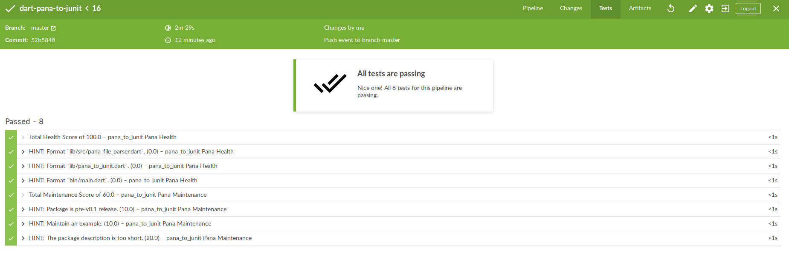
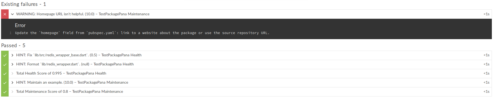

# Pana to JUnit
A dart application to convert [pana](https://github.com/dart-lang/pana) JSON output to JUnit XML format, for example to be displayed in [Jenkins CI](https://github.com/jenkinsci/jenkins).

## Example

```bash
# Run Pana on a package, e.g. redis
pub global run pana redis > out.json

# Use Pana to JUnit to convert pana output to JUnit Report
pub global run pana_to_junit --input out.json --output report.xml
```

### Include in Jenkins Workflow
This repository includes itself in its CI Workflow:

In the Jenkinsfile, have one step where `pana` is running. Afterwards, convert the output and collect it in a `post` step.
```groovy
pipeline {
    stages {
        stage('Test') {
            steps {
                echo 'Check Health'
                sh 'pub run pana --no-warning --source path ${WORKSPACE} > out.json'
                sh 'pub global run pana_to_junit:main --input out.json --output pana-report.xml'
            }
        }

    }

    post {
        always {
            junit 'pana-report.xml'
        }
    }
}
```

Depending on the severness of the suggestions, these are displayed by Jenkins BlueOcean as Accepted or failed tests.

